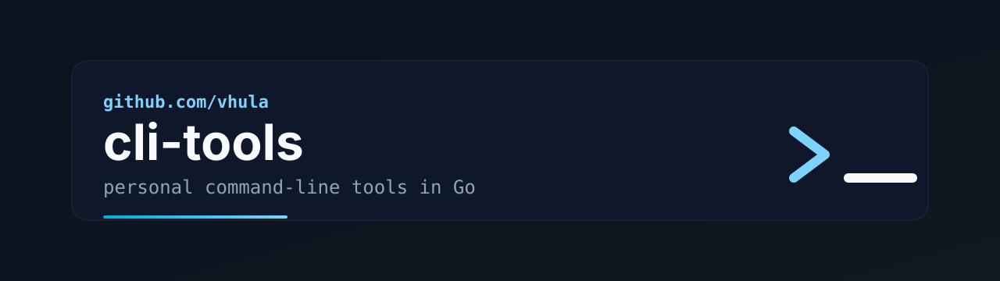

# vhula CLI tools

Personal command-line tools written in Go.

This repository is a learning and practice space inspired by the book
_Powerful Command-Line Applications in Go_. The tools here are intentionally
small and focused: each one explores a specific CLI pattern, standard-library
feature, or testing approach while staying useful enough to run from a shell.

## Tools

### `wc`

`wc` is a small word-count style utility. It reads from standard input and
prints a single count.

By default, it counts words:

```sh
echo "one two three" | ./build/wc
```

Count lines with `-l`:

```sh
printf "first\nsecond\n" | ./build/wc -l
```

Count bytes with `-b`:

```sh
printf "abc" | ./build/wc -b
```

## Requirements

- Go, matching the version declared in each tool's `go.mod`
- `just`, if you want to use the repository task shortcuts

## Build

Build all tools:

```sh
just build
```

This writes binaries to `build/`.

Build only `wc`:

```sh
just build-wc
```

You can also build it directly:

```sh
cd wc
go build -o ../build/wc main.go
```

## Test

Run all tests:

```sh
just test
```

Or run the Go tests directly:

```sh
cd wc
go test -v ./...
```

## Format

Format the Go source:

```sh
just fmt
```

## Project Layout

```text
.
├── Justfile        # Build, test, format, and clean tasks
├── LICENSE         # AGPL-3.0 license text
├── README.md
└── wc/             # Word/line/byte counter CLI
    ├── go.mod
    ├── main.go
    └── main_test.go
```

## Notes

This is a personal collection, not a polished product package. The structure is
kept simple on purpose so each tool can evolve independently as new CLI ideas
are added.

## License

This project is licensed under the GNU Affero General Public License v3.0. See
[LICENSE](LICENSE) for the full text.
